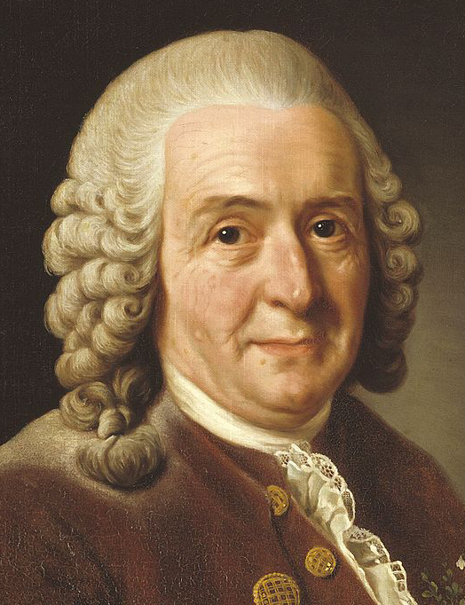

# linnaeus

This project will take a reference image and recreate it using a set of component images as 'pixels'.

### Why linnaeus?
Because apparently I didn't want to be able to type the project name without misspelling it a thousand times first.

Also because [Carl Linnaeus](https://en.wikipedia.org/wiki/Carl_Linnaeus).

---

# Installation

**Requirements:**
- Python 3.6
- OpenCV for Python. If you're not working on ARM hardware, this should be installed with the rest of the package using [opencv-python](https://github.com/skvark/opencv-python).


```sh
pip install git+git://github.com/NaturalHistoryMuseum/linnaeus.git#egg=linnaeus
```

---

# Usage

The main part of this project is the composite image creation - however, there are also some utilities for downloading and formatting images.

## Setting up a build

To run the builder, you will need:
- A reference image;
- A folder full of component images, cropped and resized to the standard 'pixel' size defined in the configuration;
- Optionally, a configuration file to override the default settings.

The example uses this painting of Carl Linnaeus as a reference image:


The component images are a subset of specimen images (roughly 15,000) downloaded from the NHM's [Data Portal](http://data.nhm.ac.uk), like this one:


Except cropped and resized to 50x50 squares (there is a utility to do this):


The configuration file should be named `.config` and be inside your working directory. If you're fine with the defaults (shown below) then you don't have to have a config file.

The config file syntax looks like this:

```yaml
pixel_width: 50
pixel_height: 50
max_ref_side: 100
saturation_threshold: 50
```

So the example project structure looks like this at the start of the first build:

```
example/
    refs/
        linnaeus.jpg
    specimens/
        00003cc8177c991aa5052cd4d4429edf5688162f.jpg
        00008d8ede2775f76bc89870bc22e207393a6d37.jpg
        00009351cb88e82fea0ebd1530b8158be665329a.jpg
        0000a2636bfac0ec061948246c16c006c75744cc.jpg
        000122b3ea236252944a992c01f25b3c2ee731e8.jpg
        ...
    .config
    main.py
```

## The script

The code for running a build can be fairly short:

```python
from linnaeus import ReferenceImage, Builder, ComponentCache

# PATH DEFINITIONS
# ----------------
ref_image_path = './refs/linnaeus.jpg'  # path to reference image
component_image_dir = './specimens'  # folder with the formatted components
cache_path = 'component.cache'  # the name doesn't really matter
map_save_dir = './maps'  # 'map' csv files will be saved into/loaded from this folder
composite_save_path = './composite.jpg'  # where to save the output

# OBJECTS
# -------
# create a reference image object
ref = ReferenceImage(ref_image_path)
# create a cache to store the dominant hsv colour for each component
cache = ComponentCache(cache_path)
# create a 'builder' to construct the composite
builder = Builder(ref, cache)

# PROCESSING
# ----------
# load or create csv 'maps' of hsv values
ref_pixel_map, component_map = builder.load_maps(map_save_dir, component_image_dir)
# create a new blank 'canvas'
builder.new_composite()
# match the components to pixels and paste onto the canvas
builder.fill(ref_pixel_map, component_map, component_image_dir, map_save_dir)
# save the canvas
builder.save_composite(composite_save_path)
```

## Running

You can then just run your script as normal.

The output on the first run will look a bit like this:
```
Loading 7600 rows |████████████████████████████████| 100%, 0
Loading 14983 rows |████████████████████████████████| 100%, 0
Calculating mesh grids...
Calculating score matrix (this may take a while)...
Calculating assignments (this may also take a while)...
113893383
Solving...
Total cost =  31105150
113893383
Loading 7600 components |████████████████████████████████| 100%, 0:00:01
Inserting images |████████████████████████████████| 100%, 0:00:23
Time taken to fill canvas: 0:29:11.364318
Saving composite...
Everything done!
```

Then subsequently:
[](https://asciinema.org/a/178460)

On first running, it may take a while - this example took around half an hour. The example folder in this repo includes all the caches and maps for `linnaeus.jpg`, so if you just want to run the example it should only take about 30 seconds.

## Utilities

There are a few limited utilities included under `linnaeus.utils`.

### API

For querying specific parts of the Data Portal API.

e.g. to find botany images (max. 100 per page):
```python
from linnaeus.utils import API

for page in API.assets(resource_id=API.COLLECTIONS, offset=0, limit=100, collectionCode='bot'):
  for media in page:
    print(media)
```

e.g. to search the collections dataset for zoology spirit records containing 'boops':
```python
from linnaeus.utils import API

for page in API.collections(query='boops', collectionCode='zoo', kindOfObject='spirit'):
    for record in page:
        print(record.get('scientificName', 'Unknown'))
```

### Formatter

This resizes and crops images to the pixel size defined in the config.

If `detect=True` when downloading, each image will be searched for 'colourful' areas and each will be cropped down to the largest area. This is just a crude attempt to try and isolate interesting parts of the images.

e.g.
```python
from linnaeus.utils import Formatter
from PIL import Image

img = Image.open('example-image.jpg')

# find the largest colourful area and crop down to that
img = Formatter.detect(img)

# rotate to landscape
img = Formatter.rotate(img)

# resize/crop to pixel size
img = Formatter.resize(img)
```

### Downloader

This works in tandem with the API and the Formatter. It's used for bulk downloading sets of assets.

It's best to make your query as specific as possible when using this to avoid overloading the API - downloading _all_ the images will take _weeks_.

As it downloads the images it will resize and crop them to the pixel size defined in the config.

e.g. download images of mineralogy specimens from a search for 'red':
```python
from linnaeus.utils import Downloader

# create a downloader object with a target folder to save into
downloader = Downloader('specimens')

# find a list of assets - this is just a wrapper for the API
assets = downloader.search(query='red', collectionCode='min')

# download those assets into the target folder - do not try to detect
# the most interesting/colourful area when cropping/resizing
downloader.download(assets, detect=False)
```

## Output

Small confession: it does cheat a _little_ bit. The pixels are matched to the best possible component (without duplicates), but just to make it look a little nicer, the component's colour is tweaked before inserting it.

Here's an example of this (unadjusted on the left, adjusted on the right):


