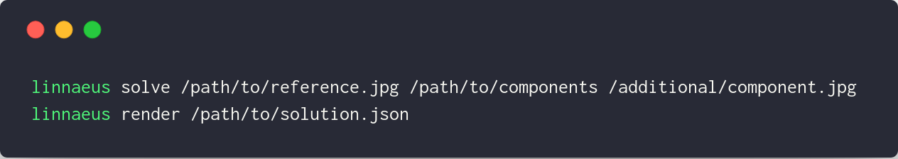

# linnaeus

[](https://travis-ci.org/NaturalHistoryMuseum/linnaeus)
[](https://coveralls.io/github/NaturalHistoryMuseum/linnaeus)

This project will take a reference image and recreate it using a set of component images as 'pixels'.

### Why linnaeus?
Because apparently I didn't want to be able to type the project name without misspelling it a thousand times first.

Also because [Carl Linnaeus](https://en.wikipedia.org/wiki/Carl_Linnaeus).

---

# Installation

**Requirements:**
- Python 3.6
- OpenCV for Python. If you're not working on ARM hardware (you're probably not), this should be installed with the rest of the package using [opencv-python](https://github.com/skvark/opencv-python).


```sh
pip install git+git://github.com/NaturalHistoryMuseum/linnaeus.git#egg=linnaeus
```

---

# Usage

A more detailed example, along with all the files needed to run it, can be found in the `example` folder of this repo.

To run the builder, you will need:
- A reference image;
- A folder full of component images;
- Optionally, a configuration file to override the default settings.

You can then either write a script to run it (see the example), or use the command line interface.

## CLI

The CLI is fully documented (try `linnaeus -h`), so here's a minimal example that doesn't cover all commands but will produce a composite:



An animated example of using the CLI and the expected output can be found the example README.

## Utilities

There are a few limited utilities included under `linnaeus.utils`.

### API

For querying specific parts of the Data Portal API.

e.g. to find botany images (max. 100 per page):
```python
from linnaeus.utils import API

for page in API.assets(resource_id=API.COLLECTIONS, offset=0, limit=100, collectionCode='bot'):
  for media in page:
    print(media)
```

e.g. to search the collections dataset for zoology spirit records containing 'boops':
```python
from linnaeus.utils import API

for page in API.collections(query='boops', collectionCode='zoo', kindOfObject='spirit'):
    for record in page:
        print(record.get('scientificName', 'Unknown'))
```

### Formatter

This resizes and crops images to the pixel size defined in the config.

It is used to resize images automatically when creating a component, but it does not rotate or detect automatically.

If `detect=True` when downloading, each image will be searched for 'colourful' areas and each will be cropped down to the largest area. This is just a crude attempt to try and isolate interesting parts of the images.

e.g.
```python
from linnaeus.utils import Formatter
from PIL import Image

img = Image.open('example-image.jpg')

# find the largest colourful area and crop down to that
img = Formatter.detect(img)

# rotate to landscape
img = Formatter.rotate(img)

# resize/crop to pixel size
img = Formatter.resize(img)
```

### Downloader

This works in tandem with the API and the Formatter. It's used for bulk downloading sets of assets.

It's best to make your query as specific as possible when using this to avoid overloading the API - downloading _all_ the images will take _weeks_.

As it downloads the images it will resize and crop them to the pixel size defined in the config.

e.g. download images of mineralogy specimens from a search for 'red':
```python
from linnaeus.utils import Downloader

# create a downloader object with a target folder to save into
downloader = Downloader('specimens')

# find a list of assets - this is just a wrapper for the API
assets = downloader.search(query='red', collectionCode='min')

# download those assets into the target folder - do not try to detect
# the most interesting/colourful area when cropping/resizing
downloader.download(assets, detect=False)
```

### Cleaner

This helps to purge errant components from your input map.

```python
from linnaeus.maputils.clean import clean_colour, clean_similar_to

clean_colour('specimens.json', False, s=150, st=20, v=234, vt=5)

clean_similar_to('solution_map.json', 'specimens.json', 40, 24, False)
```

## Output

Small confession: it does cheat a _little_ bit. The pixels are matched to the best possible component (without duplicates), but just to make it look a little nicer, the component's colour is tweaked before inserting it.

Here's an example of this (unadjusted on the left, adjusted on the right):


If you don't want this behaviour, add `adjust=False` into the `Builder.fill()` method:

```python
solution = Builder.solve(reference_map, component_map)
canvas = Builder.fill(solution, adjust=False)
canvas.save('output.jpg')
```

## More information

The main part of this project is the composite image creation - however, there are also some utilities for downloading and formatting images.

The core is divided into **map generation** and **processing**. These parts operate independently; **processing** does not call anything from **generation** and vice versa.

**Map generation** creates JSON-based 'maps' (which can be saved, loaded, and parsed as normal JSON) of the colour of each pixel in the reference image and the dominant colour of each provided component image.

**Processing** uses those maps to figure out which component image best matches each pixel (without repeating any), then builds an image from that. 
